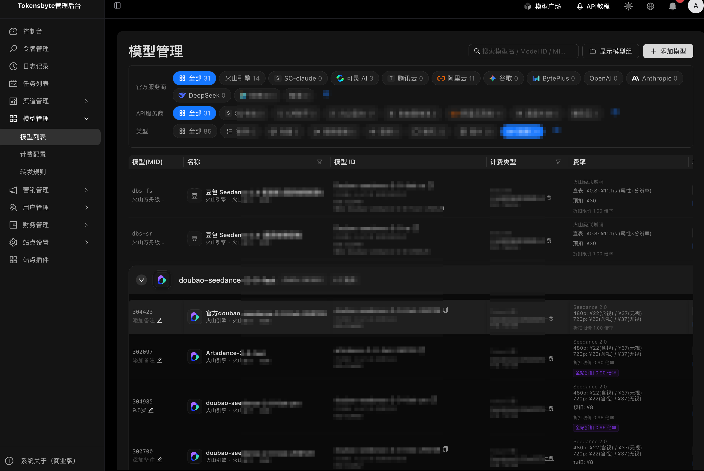
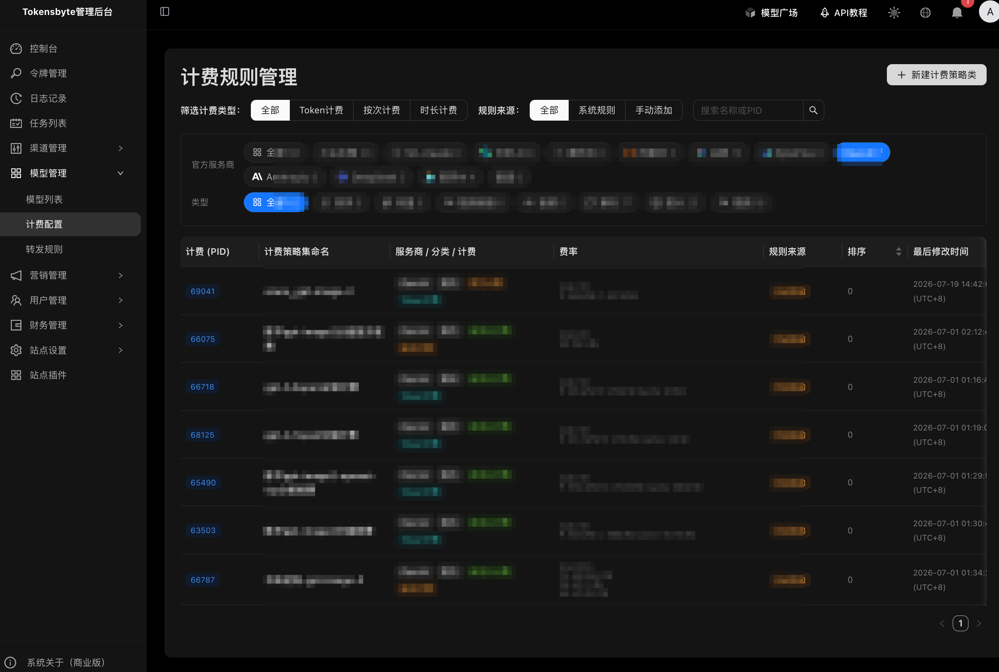
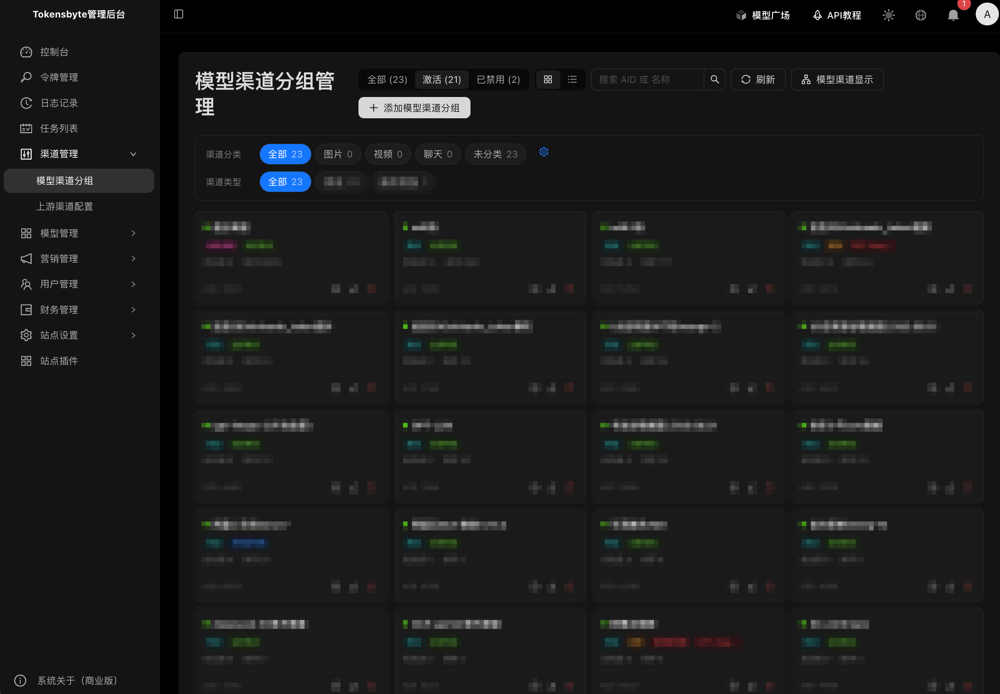
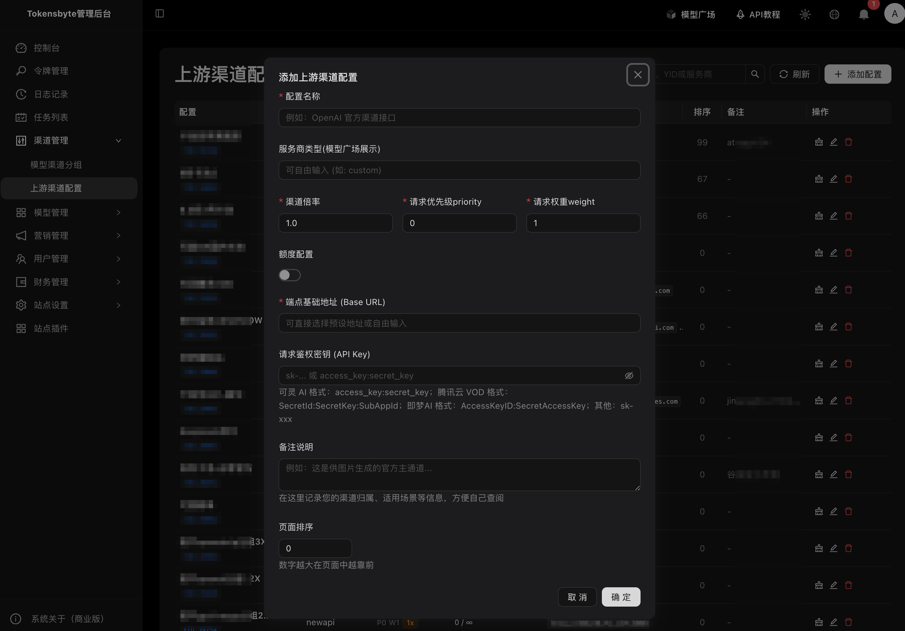
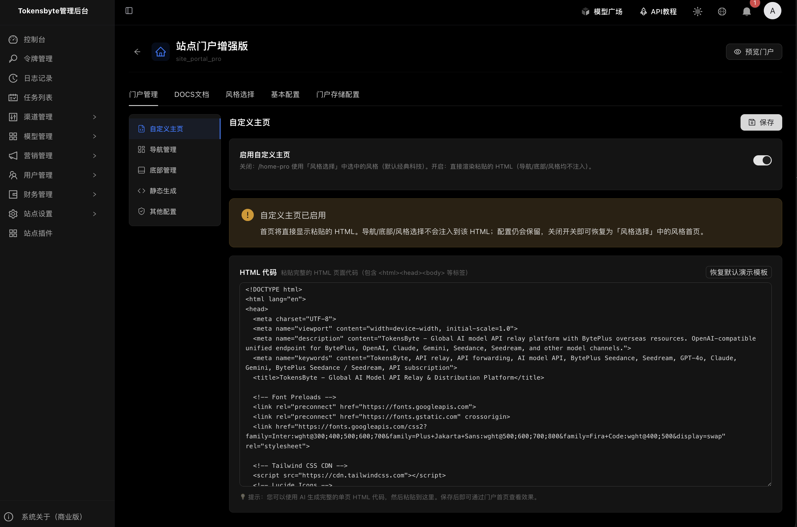
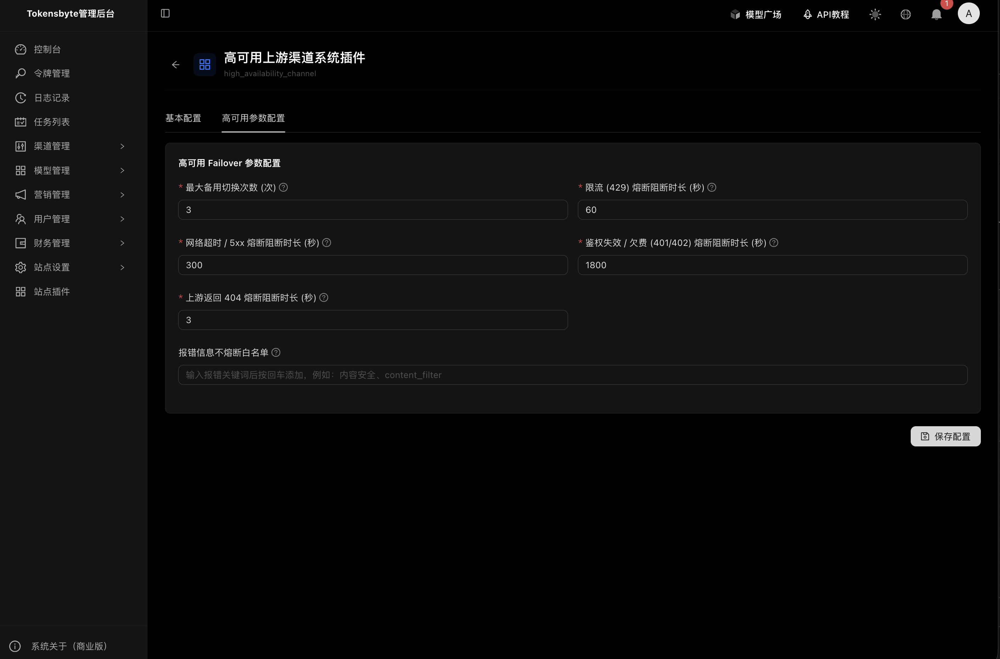

# TokensByte — LLM API 网关

Rust + React 构建的高性能大模型 API 分发与管理平台：统一接入、计费、限流、审计。

计费规则+转发规则+模型转发 可以任意添加不同的模型；目前支持各种模型，开源系统核心功能开源。

支持模型

Seedance2.0计费，各种模型计费，DeepSeek分时计费、GLM、K3

Openai-GPT/Google-Gemini/Anthropic-Claude/XAI-Grok  全线支持

核心功能


|  |  | 模型管理 |
| ------------------------------------------------------- | ------------------------------------------------- | -------- |
|        |  | 上游配置 |
|        |  | 基础插件 |

## 

目录

- [TokensByte — LLM API 网关](#tokensbyte--llm-api-网关)
  - [](#)
  - [功能概览](#功能概览)
  - [技术栈](#技术栈)
  - [快速部署](#快速部署)
    - [1）一键启动](#1一键启动)
    - [2）交互式部署（推荐）](#2交互式部署推荐)
    - [3）自定义 / 外部数据库](#3自定义--外部数据库)
    - [模式对照](#模式对照)
  - [使用入门](#使用入门)
  - [本地开发](#本地开发)
    - [目录结构（精简）](#目录结构精简)
  - [常见问题](#常见问题)
  - [贡献与许可](#贡献与许可)

## 功能概览


| 能力       | 说明                                               |
| ---------- | -------------------------------------------------- |
| 统一接入   | OpenAI 兼容接口；文本 / 图像 / 视频 / 嵌入等多模态 |
| 路由与 HA  | 渠道权重、转发规则、故障转移、限流熔断             |
| 计费与钱包 | 规则计费、预扣结算、系统/赠送/信控钱包、充值支付   |
| 安全       | JWT、Admin/User 双端隔离、API Key、操作审计        |
| 运营       | 仪表盘、日志/任务、财务统计、插件扩展              |

## 技术栈


| 层   | 技术                                                                    |
| ---- | ----------------------------------------------------------------------- |
| 后端 | Rust · Axum · Tokio · SQLx (PostgreSQL only)                         |
| 前端 | React 19 · TypeScript · Ant Design 6 · Tailwind 4 · Zustand · Vite |
| 部署 | Docker Compose · Nginx · PostgreSQL 18.4                              |

```
客户端 / SDK  ──▶  API 网关(鉴权/限流/路由)  ──▶  上游模型
管理后台      ──▶  业务层(配额/计费/统计)    ──▶  PostgreSQL
```

## 快速部署

**环境**：Docker 20.10+、Compose 2.x；建议 4C / 8G / 50GB。

### 1）一键启动

```bash
git clone <repository-url>
cd tokensbyte
docker compose up -d --build
```

- 前台：`http://localhost:8080`
- 管理端：`http://localhost:8080/admin1688`
- 首次访问管理端走网页初始化页设置管理员账号（不再用环境变量启动种子化）

生产请务必修改 `.env` 中的数据库密码与 JWT 密钥；并设置 `CORS_ORIGINS`（前端来源）。若前面有 Nginx/Caddy 反代，请正确设置 `X-Forwarded-For` / `X-Real-IP`，注册与登录 IP 会优先读取这些头。

### 2）交互式部署（推荐）

```bash
chmod +x deploy.sh && ./deploy.sh
```

引导生成 DB 密码、JWT，并可选开发/生产模式。

### 3）自定义 / 外部数据库

```bash
cp .env.example .env   # 按注释修改
docker compose up -d
```

使用外部 PostgreSQL：改 `DATABASE_URL`，并在 `docker-compose.yml` 中停用内置 `postgres` 服务。

### 模式对照


| 配置                       | 场景                                     |
| -------------------------- | ---------------------------------------- |
| `docker-compose.yml`       | 生产 / 测试                              |
| `+ docker-compose.dev.yml` | 容器内热重载开发                         |
| `dev.sh` / `dev.ps1`       | 本机前后端热重载（共用 Docker Postgres） |
| `dev-os.sh`                | 开源版本地启动                           |

离线镜像导出：`./export-images.sh`（Windows：`.\export-images.ps1`）。**Mac 后端强制宿主机 `cargo-zigbuild`** 生成 `tokensbyte-server-bin` 再 `USE_PREBUILT=1` 打包，避免 Docker 内 cargo OOM/QEMU；失败会直接退出（`ALLOW_DOCKER_CARGO=1` 才允许容器内编译）。详见 `docs/Mac开发环境打包与交叉编译指南.md`。

打包提速（不影响线上运行时逻辑）：

- **同架构**构建 + 保留 BuildKit Cargo cache（`ENABLE_CARGO_CACHE=1`，默认开）；勿随意 `docker builder prune`，否则会丢缓存变回全量编译
- **Mac**：脚本内联 zigbuild + `--features cross_compile`；`USE_PREBUILT=1` 时前后端并行；外置盘自动迁 `CARGO_TARGET_DIR`；`FORCE_ZIGBUILD=1` 重编；失败即停（`ALLOW_DOCKER_CARGO=1` 才允许容器内编译）
- **Windows**：`.\export-images.ps1` / `.\push-images.ps1` 默认 `JOBS=2`；OOM 时 `$env:CARGO_BUILD_JOBS=1`；同样勿随意 prune；根目录放 Linux ELF `tokensbyte-server-bin` 会自动 `USE_PREBUILT=1`
- **Windows 中文路径**：脚本已 UTF-8 + 自动把中文目录名映射为 ASCII 的 `PROJECT_NAME`（也可手动 `$env:PROJECT_NAME='myproject'`）；**仓库路径仍建议纯英文**（否则 Docker COPY/挂载可能失败）
- 同架构 Linux 上先编好 `tokensbyte-server-bin`（ELF）再导出：脚本会自动 `USE_PREBUILT=1`，镜像阶段跳过容器内 Rust 编译
- 仅重新打 tar：`SKIP_BUILD=1`（bash）或 `$env:SKIP_BUILD=1`（PowerShell）；正式发版优先 CI 推镜像后服务器 `pull`

## 使用入门

1. 登录管理端 → 配置渠道与模型
2. 用户端创建 API 令牌并设置额度
3. 业务侧将 Base URL 指向网关 `/v1`，使用令牌调用

```bash
curl http://localhost:8080/v1/chat/completions \
  -H "Authorization: Bearer sk-xxx" \
  -H "Content-Type: application/json" \
  -d '{"model":"gpt-3.5-turbo","messages":[{"role":"user","content":"Hello"}]}'
```

健康检查：`GET /api/health`。

常用管理 API 前缀：`/api/v1/auth`、`/users`、`/channels`、`/models`、`/tokens`、`/finance`、`/logs`、`/settings`。

## 本地开发

```bash
# 推荐：一键（默认后台；自动起/复用 Postgres；端口占用时顺延；多 checkout 可并行）
./dev.sh              # Linux/Mac 后台
./dev.sh fg           # Linux/Mac 前台看日志（Ctrl+C 停本实例）
.\dev.ps1             # Windows 后台
.\dev.ps1 1 fg        # Windows 前台看日志
```

可选环境变量：`BACKEND_PORT` / `FRONTEND_PORT` / `POSTGRES_PORT` / `DEV_WAIT_MAX` / `DEV_ATTACH=1` / `TOKENSBYTE_FAST_LINK=0` / `TOKENSBYTE_LOCAL_TARGET=0` / `TOKENSBYTE_SCCACHE=0` / `TOKENSBYTE_AUTO_BREW=0` / `RUST_LOG`（本地 `dev.sh`/`dev.ps1` 默认 `info`；要 debug：`RUST_LOG=debug ./dev.sh`；部署/`docker-compose` 亦默认 `info`）。仓库在 `/Volumes/...` 外置盘时，`dev.sh` 会把 `CARGO_TARGET_DIR` 迁到 `~/Library/Caches/tokensbyte-dev/target/...`（本机 SSD）以加速编译；macOS 默认会自动 `brew install sccache`（不自动装巨型 `llvm`；若本机已有 `ld64.lld` 仍会启用链接加速）。`[profile.dev]` 开启增量并减小调试信息；Windows（`dev.ps1`）默认 `rust-lld`（中文路径会重定向 `CARGO_TARGET_DIR` 到 `%LOCALAPPDATA%\tokensbyte-dev\target\...`）；Linux 可选 mold/lld。**勿随意删除 `backend/target` 或本机 `CARGO_TARGET_DIR`（Windows 含上述重定向目录）**，否则下次启动会冷编译；链接加速仅影响本机开发耗时，不改变运行行为。

原生方式：

```bash
# 后端
cd backend && cp .env.example .env
APP_ENV=development cargo run   # 开发秒退，跳过计费 drain

# 前端
cd frontend && npm install && npm run dev
# http://localhost:5173 → 代理到后端 :3000
```

**黄金三步（Rust CI）**：`cargo fmt --all` → `cargo clippy --all-targets --all-features -- -D warnings` → `cargo test --all-targets --all-features`。

### 目录结构（精简）

```
tokensbyte/
├── backend/src/     # api · relay · db · services · money …
├── frontend/src/    # pages · components · store · utils
├── docker-compose.yml
├── docker-compose.dev.yml
├── deploy.sh · dev.sh · export-images.sh
├── README.md · CHANGELOG.md
└── data/            # 持久化（本地）
```

## 常见问题

**只支持哪些数据库？**
仅 PostgreSQL。勿把 `DATABASE_URL` 指到其他引擎。

**内置库还是外部库？**
开发 / 小规模 Linux 生产可用 Compose 内置；Windows/Mac 生产或大数据量建议外部 RDS / 独立安装。

**如何备份？**
`pg_dump` / `pg_restore`。应用启动会自动跑增量迁移。

**管理员怎么创建？**
首次打开管理端走网页初始化页设置账号密码；后端不再读取 `ADMIN_PASSWORD` / `SEED_ADMIN_ON_BOOT`。

## 贡献与许可

1. Fork → 特性分支 → PR
2. Rust：`fmt` + `clippy -D warnings` + `test`；前端遵循 ESLint
3. 提交信息建议：`type(scope): description`

许可证：[MIT](LICENSE)

问题反馈：GitHub Issues

TG交流技术支持群：[https://t.me/tokensbyte](https://t.me/tokensbyte)


变更记录：[CHANGELOG.md](CHANGELOG.md)
